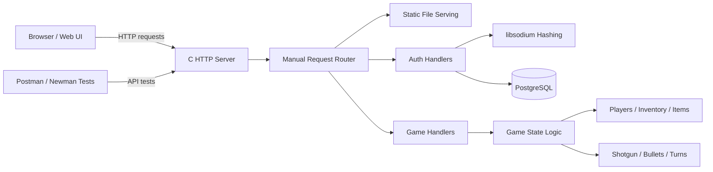

# Shotgun Game Server

<p align="center">
  <em>A multiplayer game backend written in C with custom HTTP routing, PostgreSQL-backed authentication, token validation, and automated API testing.</em>
</p>


<p align="center">

</p>

<p align="center">
  
</p>

<p align="center">

</p>


---

## Overview

**Shotgun Game Server** is a C-based web server and backend for a multiplayer turn-based shotgun game. The project was built to learn how backend systems work below the framework level: raw sockets, request parsing, HTTP responses, routing, password hashing, session tokens, PostgreSQL queries, and automated tests.

Unlike a typical web project built with Express, Flask, or Django, this project implements the core server behavior directly in C. The server listens on port `8080`, serves static HTML/CSS/JavaScript files, handles authentication routes, stores users in PostgreSQL, validates login tokens, and includes game-state logic for players, items, inventory, bullets, and turns.

This project is meant to show practical systems programming ability: memory management, C structs, pointers, database integration, low-level networking, authentication design, and CI testing.

---

## Why This Project Matters

I wanted to build a backend project where I could not hide behind a framework. By implementing the server in C, I had to understand how requests are received, parsed, routed, validated, and turned into responses.

This project helped me practice the kind of engineering used in lower-level software roles: reasoning about buffers, structs, sockets, system calls, concurrency, database state, and security boundaries.

---

## Features

- Custom HTTP server written in C using POSIX sockets
- Multi-threaded request handling with `pthread`
- Static file serving for HTML, CSS, JavaScript, and authentication pages
- User signup endpoint with password hashing
- Login endpoint with password verification
- Token generation and token hashing using `libsodium`
- PostgreSQL-backed user and session storage using `libpq`
- Permission endpoint for validating user tokens
- Initial game creation endpoint
- Game logic modules for players, items, inventory, turns, shotgun state, and bullets
- Postman/Newman API tests
- C unit tests for helper logic
- GitHub Actions workflow for automated build and test execution

---

## Tech Stack

| Area | Technologies |
|---|---|
| Core language | C |
| Networking | POSIX sockets, TCP, HTTP |
| Concurrency | pthreads |
| Database | PostgreSQL, libpq |
| Security | libsodium, password hashing, token hashing |
| Frontend | HTML, CSS, JavaScript, localStorage |
| Testing | C unit tests, Postman, Newman |
| Automation | GitHub Actions, Bash scripts |
| Environment | Linux / Ubuntu |

---

## Architecture



The active implementation is in the `latest/` directory. It contains the current server, database layer, authentication handlers, game logic, frontend files, test scripts, and Postman collection.

---

## Project Structure

```text
latest/
├── database/
│   ├── database.c/.h          # PostgreSQL connection helpers
│   ├── init.sql               # Database schema
│   └── test_init.sql          # Test users and seed data
│
├── logic/
│   ├── game/                  # Player list, turns, inventory, actions
│   └── objects/               # Bullets, items, notes, shotgun state
│
├── postman/
│   └── shotgun.postman_collection.json
│
├── server/
│   ├── main.c                 # Server entry point
│   ├── sender.c/.h            # HTTP response helpers and socket setup
│   ├── handlers/
│   │   ├── authentication/    # Signup, login, permission/token validation
│   │   └── games/             # Game creation route
│   ├── helpers/               # JSON parsing helpers
│   └── result/                # Result/error handling abstraction
│
├── tests/                     # C unit tests
├── web/                       # Static HTML/CSS/JavaScript UI
├── Makefile                   # Build targets
├── test.sh                    # Full integration test runner
└── unit_test.sh               # Unit test runner
```

---

## API Routes

| Route | Method | Purpose |
|---|---:|---|
| `/` | `GET` | Serves the home page |
| `/authentication/login.html` | `GET` | Serves login page |
| `/authentication/signup.html` | `GET` | Serves signup page |
| `/authentication/permission.html` | `GET` | Serves token validation page |
| `/signup` | `POST` | Creates a new user with a hashed password |
| `/login` | `POST` | Verifies password and returns a session token |
| `/permission` | `POST` | Validates a user's token and expiration status |
| `/games` | `POST` | Starts initial game creation flow |

---

## Example Requests

### Signup

```json
{
  "user_name": "Alice",
  "email": "alice@example.com",
  "password": "example-password"
}
```

### Login

```json
{
  "email": "alice@example.com",
  "password": "example-password"
}
```

Example success response:

```json
{
  "status": "success",
  "user_id": "1",
  "user_name": "Alice",
  "token": "generated-session-token"
}
```

### Permission Check

```json
{
  "user_id": "1",
  "token": "generated-session-token"
}
```

Example success response:

```json
{
  "status": "success",
  "permission": "allowed"
}
```

---

## Setup

### Prerequisites

Install the required system dependencies:

```bash
sudo apt-get update
sudo apt-get install -y gcc make postgresql postgresql-contrib libpq-dev libsodium-dev nodejs npm
sudo npm install -g newman
```

### Clone the repository

```bash
git clone https://github.com/<your-username>/<your-repo-name>.git
cd <your-repo-name>/latest
```

### Configure environment variables

Create an environment file for local development:

```bash
cp env.example env.run
```

Example environment values:

```bash
DB_NAME=shotgun
DB_USER=shotgun_admin
DB_PASSWORD=change-me
DB_HOST=localhost
DB_PORT=5432
```

> Do not commit real database credentials. Keep local `.env` or `env.run` files out of version control.

### Initialize the database

Start PostgreSQL:

```bash
sudo service postgresql start
```

Create a local database and user:

```bash
sudo -u postgres psql -c "CREATE ROLE shotgun_admin LOGIN PASSWORD 'change-me';" || true
sudo -u postgres createdb shotgun -O shotgun_admin || true
sudo -u postgres psql -d shotgun -f database/init.sql
```

Optional: load test users and games:

```bash
sudo -u postgres psql -d shotgun -f database/test_init.sql
```

---

## Build and Run

Build the server:

```bash
make rebuild
```

Run the server:

```bash
set -a
source env.run
set +a
./shotgun
```

Open the app in a browser:

```text
http://localhost:8080
```

---

## Testing

Run the full test script:

```bash
./test.sh
```

The test script performs the following steps:

1. Starts PostgreSQL
2. Creates a clean test database
3. Initializes schema and seed data
4. Builds the C unit test binary
5. Runs unit tests
6. Builds the server
7. Starts the server in the background
8. Runs Postman/Newman API tests
9. Stops the server

Run only the unit tests:

```bash
./unit_test.sh
```

---

## What I Learned

- How a basic HTTP server works underneath a web framework
- How to accept TCP connections and route requests in C
- How to manage request buffers and avoid common C string mistakes
- How to separate request data, database context, and response data using structs
- How to hash passwords and avoid storing plaintext credentials
- How to generate, hash, store, and validate session tokens
- How to use PostgreSQL from C with `libpq`
- How to write integration tests for API endpoints using Postman/Newman
- How to automate build and test workflows with GitHub Actions
- How quickly project complexity grows when authentication, persistence, and routing are implemented manually

---

## Engineering Challenges

### Manual request parsing

Because this server does not use a framework, the request routing, body extraction, and response formatting are handled manually. This made buffer sizes, string termination, and malformed input handling important design concerns.

### Authentication state

Login is not just a password check. The server also needs to generate a token, hash it, store it with an expiration time, and later compare a user-provided token against the database value.

### Testing a C backend

Testing required more than compiling the code. The full test flow needed PostgreSQL setup, seed data, a running server process, and API-level assertions through Newman.

### Keeping game logic separate from server logic

The game engine modules are separated from the HTTP handlers so the game rules can evolve independently from the web/API layer.

---

## Current Status

The project currently supports the core server, authentication, token validation, static frontend pages, database schema, automated build/test scripts, and initial game-state logic.

The next major step is to finish connecting multiplayer game creation and turn progression to the database-backed API.

---

## Future Improvements

- Complete the `/games` endpoint so users can create games with selected players
- Store active game state in PostgreSQL
- Add endpoints for turn actions, inventory use, and shooting actions
- Improve JSON parsing or integrate a dedicated C JSON library
- Add stronger request validation and clearer HTTP status messages
- Add password input masking on the frontend
- Improve frontend UI for active games and player turns
- Add Docker Compose for PostgreSQL and local development
- Expand CI to run unit tests, integration tests, and static analysis
- Add screenshots or a short GIF showing signup, login, and permission validation

---

## Repository Cleanup Notes

Before treating this as a polished portfolio repository, I would clean up the repository by:

- Removing compiled binaries such as `shotgun`, `test`, `a.out`, and `main`
- Moving old versions like `v1.1/` into an `archive/` folder or separate branch
- Replacing committed environment files with `env.example`
- Adding a stronger `.gitignore`
- Adding screenshots under a `screenshots/` folder
- Adding a license file
- Renaming the repository from a generic name to something like `shotgun-game-server`

---

## Suggested Repository Description

> C-based multiplayer game server with custom HTTP routing, PostgreSQL authentication, token validation, game-state logic, and automated API tests.

---

## Suggested Topics

```text
c, backend, sockets, postgresql, libpq, libsodium, authentication, pthreads, http-server, newman, postman, github-actions, systems-programming
```

---

## License

This project is currently unlicensed. Add a license before encouraging external reuse.
